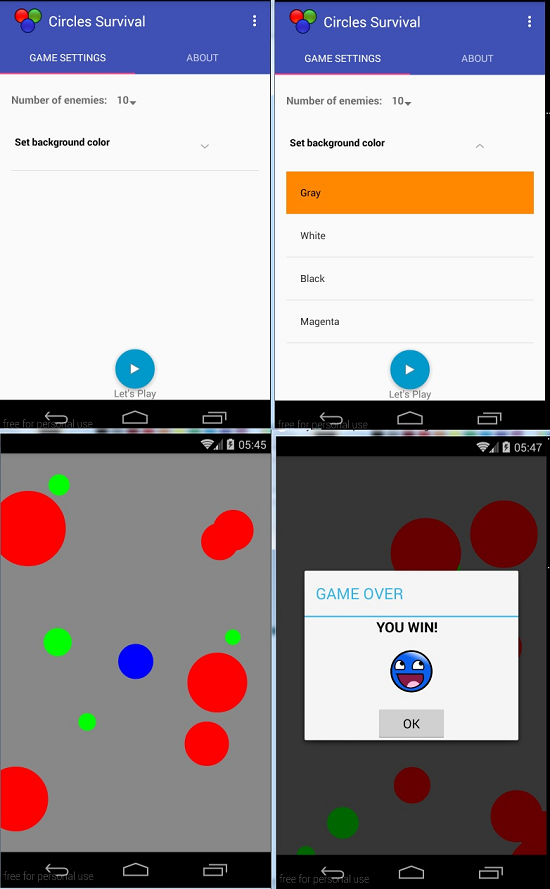

# CirclesSurvival

My remake of game [RGBCircles!](https://github.com/khasang/RGBCircles)

You should eat green circles and run away from the reds.
When your eat green, the player circle is growing, when the radius of the player becomes bigger than radiuses of the red circles, their colors are changing to green.
To win you need to eat all circles.

